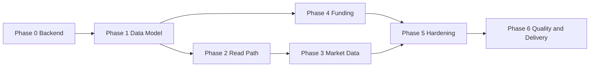

# $Goblin — Production Roadmap

Status date: 2026-07-10
Current version: 0.1.0 (React 18 + Vite 5 + Supabase)

---

## 1. Current State Assessment

### Working
- **Routing & auth shell** — [`src/App.jsx`](../src/App.jsx), [`ProtectedRoute.jsx`](../src/components/ProtectedRoute.jsx)
- **Auth** — signup / login / signout + session listener in [`AuthContext.jsx`](../src/context/AuthContext.jsx)
- **DB service layer** — full CRUD in [`db.js`](../src/services/db.js)
- **DB schema + RLS** — [`initial_schema.sql`](../supabase/migrations/20240101000000_initial_schema.sql)
- **Write path wired** — [`FixedDeposit.jsx`](../src/components/FixedDeposit.jsx), [`Withdraw.jsx`](../src/pages/Withdraw.jsx), [`Launchpad.jsx`](../src/components/Launchpad.jsx) persist to Supabase using the real user id
- **Full styled UI** — 9 pages, ~37 KB CSS

### Gaps / Blockers
| # | Gap | Impact |
|---|-----|--------|
| B1 | `.env` holds placeholder Supabase creds | Nothing connects to a live backend |
| B2 | No account-balance / ledger concept in schema | Withdrawals unvalidated; no real portfolio value |
| B3 | Read path unwired — `db.js` getters never called in UI | Dashboard shows static mock data |
| B4 | [`UserProfile.jsx`](../src/components/UserProfile.jsx) fully hardcoded | Shows fake user, not the signed-in one |
| B5 | Prices static in [`marketData.js`](../src/data/marketData.js) | No live market data |
| B6 | Hardcoded fallback creds in [`supabase.js`](../src/lib/supabase.js) | Security / silent-failure risk |
| B7 | No tests, lint, or CI | Quality / regression risk |
| B8 | StakePool / Payment / Leverage wiring unverified | Feature completeness unknown |

---

## 2. Phased Plan

### Phase 0 — Backend Foundation (unblocks everything)
- Create a real Supabase project; capture URL + anon key
- Populate `.env`; confirm `.env` is git-ignored; remove hardcoded fallbacks in [`supabase.js`](../src/lib/supabase.js) and fail fast if env vars missing
- Apply the migration to the Supabase project
- End-to-end verify: signup -> profile row created -> login -> protected route access

### Phase 1 — Data Model Completion
- Add a **balances / wallet** table (or a computed view) so portfolio value and available funds are real
- Validate withdrawals against available balance in [`createWithdrawal()`](../src/services/db.js)
- Add `updated_at` triggers; define status lifecycle (`matured_at`, `unlocked_at`)
- Add a deposit/funding source so the Payment flow can credit balance

### Phase 2 — Read Path (display real data)
- Dashboard: replace mock metrics/allocations/activity with `getUserDeposits`, `getUserStakes`, `getUserTransactions`, `getUserAllocations`
- UserProfile: load the real profile from the `profiles` table
- Add "My deposits / stakes / allocations / transactions" list views
- Consistent loading + empty + error states

### Phase 3 — Live Market Data
- Integrate a price API (e.g. CoinGecko) for crypto prices + `FloatingTicker`
- Polling/caching strategy; graceful fallback to cached values
- Decide scope for equities in [`TopStocks.jsx`](../src/components/TopStocks.jsx)

### Phase 4 — Funding & Remaining Features
- Wire [`Payment.jsx`](../src/components/Payment.jsx) funding flow into balance
- Verify + complete [`StakePool.jsx`](../src/components/StakePool.jsx) wiring
- Decide scope for [`Leverage.jsx`](../src/components/Leverage.jsx) (simulated vs. persisted)

### Phase 5 — Hardening & UX
- Replace inline status strings with toast/notification system
- Global error boundary; form validation library
- RLS/security review; rate-limit sensitive actions

### Phase 6 — Quality & Delivery
- Add ESLint + Prettier
- Add Vitest + React Testing Library; cover auth + db service
- GitHub Actions CI (lint + test + build)
- Deploy (Vercel/Netlify) with env vars configured

---

## 3. Dependency Order

Phase 0 gates all runtime work. Data model (Phase 1) gates both read path and funding.
